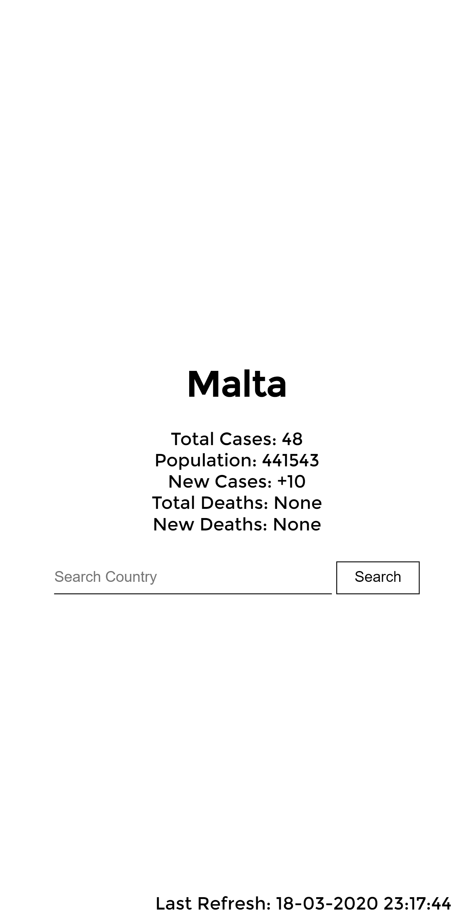

# Covid19 tracker in flask!

## TODO

- DONE Change infrastructure to hold and cache all the countries in the odometer
- DONE Add a search bar
- Add meta tags
- Add icon
- Asynchronously refresh the data according to a specified interval to prevent scraping from occuring on a request (which heavily slows down response time)
- Handle non existant countries.

## Example images

