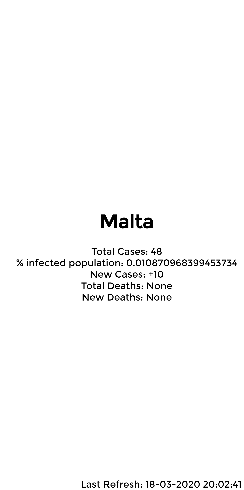

# Covid19 tracker in flask!

## TODO

- Change infrastructure to hold and cache all the countries in the odometer
- Add a search bar
- Add meta tags
- Add icon
- Truncate infected population percentage to 4 D.P

## Example images

